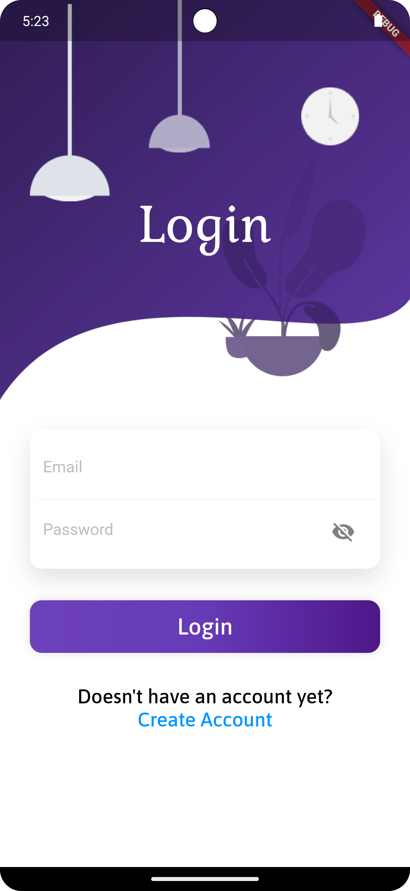
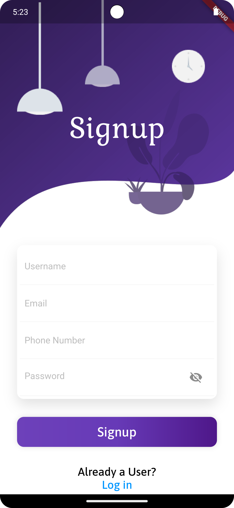
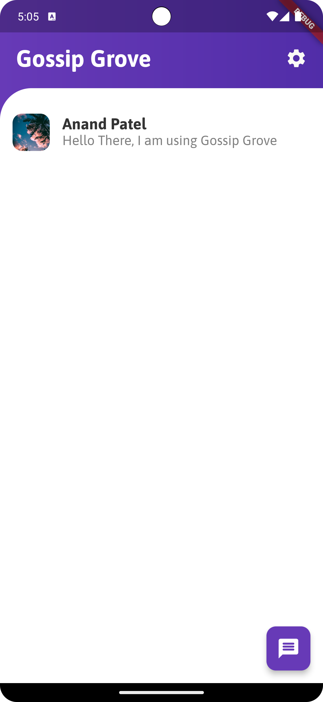
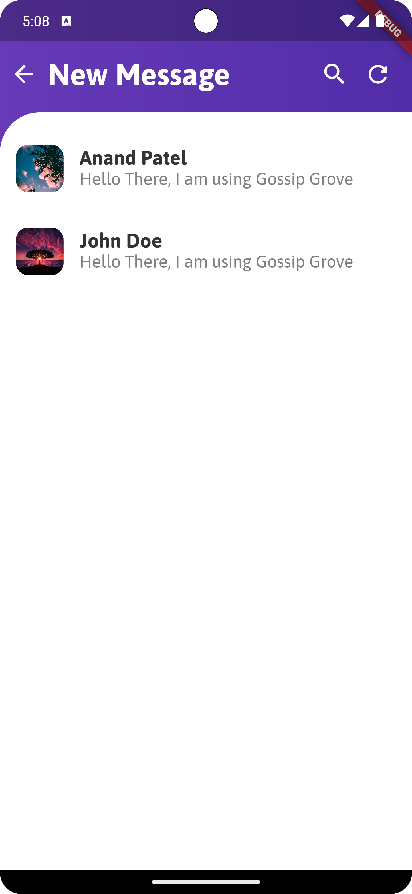
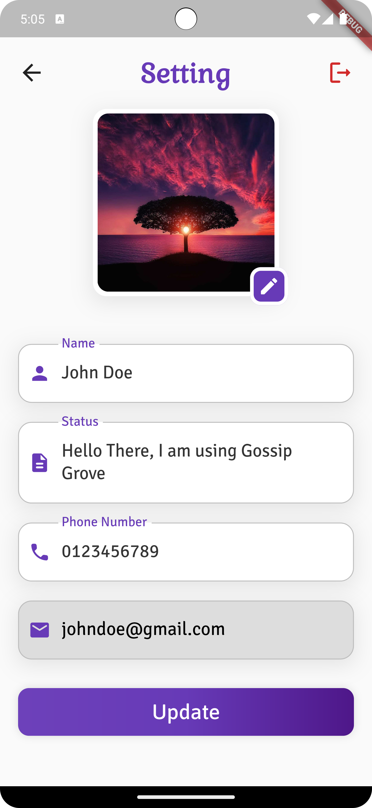
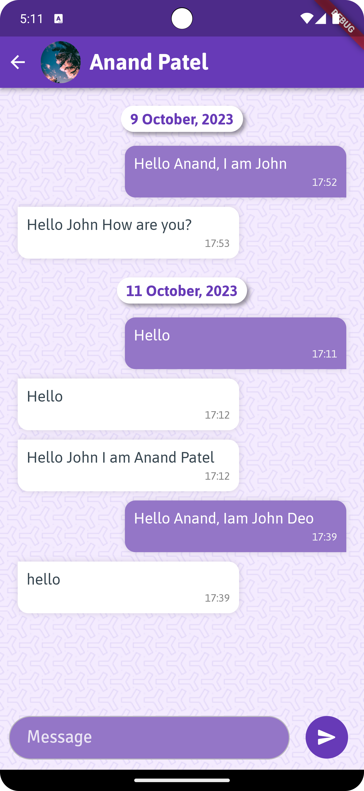
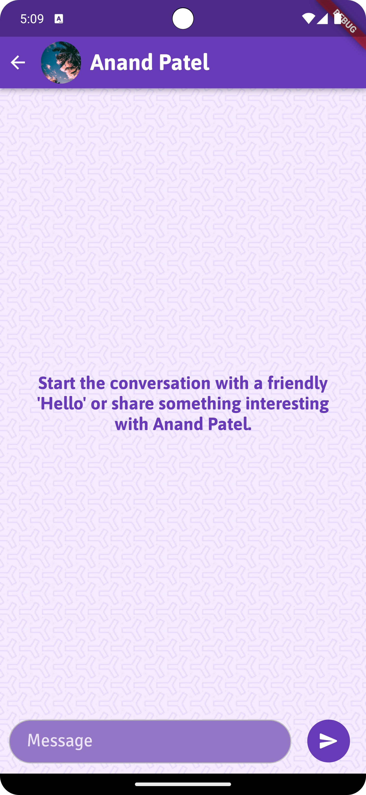
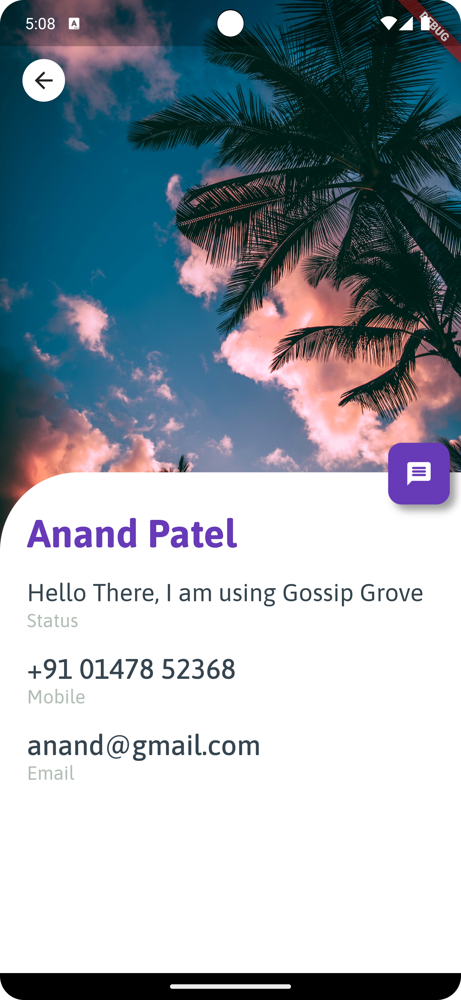

# Gossip Grove Frontend

## Overview

<b>Gossip Grove is a real-time chat application with a Flutter frontend that allows users to engage in one-on-one and group chats. The Flutter frontend provides an intuitive and responsive user interface to interact with the Gossip Grove backend.</b>

## Technologies Used

- <b>Flutter:</b> The Gossip Grove frontend is built using the Flutter framework, which allows for cross-platform mobile app development.
- <b>Dart:</b> Dart is the primary programming language used in Flutter development.
- <b>Socket.IO Client:</b> We utilize a Socket.IO client library to enable real-time communication between the frontend and the Gossip Grove backend.
- <b>Firebase Cloud Messaging:</b> When User is offline, it will send the message notification.
- <b>Firebase Storage:</b> User's Profile Image Will be stored in Firebase Storage.

## Installation

### Prerequisites

<b>Flutter:</b> Ensure you have Flutter installed on your development machine. You can find installation instructions at [flutter.dev](https://docs.flutter.dev/get-started/install).

### Getting Started

#### 1. Clone the Gossip Grove Flutter frontend repository to your local machine.

```
git clone https://github.com/Anand-s-FlutterLab/Gossip-Grove-Frontend.git
cd gossip-grove-frontend
```

#### 2. Install the project dependencies using Flutter's package manager, pub.

```
flutter pub get
```

#### 3. Set up the backend endpoint in the Flutter code. Open the <u><i>lib/constant/constant.dart</i></u> and specify the URL of your Gossip Grove backend API in <u><i>baseUrl</i></u> variable.

```
const baseUrl = 'https://your-gossip-grove-backend.com';
```

#### 4. Build and run the Flutter app on your preferred platform (iOS or Android).

```
flutter run
```

## Features

The Gossip Grove Flutter frontend offers a range of features, including:

- <b>User Authentication:</b> Users can log in or register for a new account.
- <b>One-on-One Chats:</b> Engage in private one-on-one conversations.
- <b>Real-time Messaging:</b> Receive and send messages in real-time using socket.io for instant communication.
- <b>Profile Management:</b> Edit your profile, update your avatar, and manage your personal information.
- <b>Notifications:</b> When You offline, notifications will be received.

## Screenshots
<p align="center">



</p>
<br>
<p align="center">



</p>
<br>
<p align="center">



</p>
